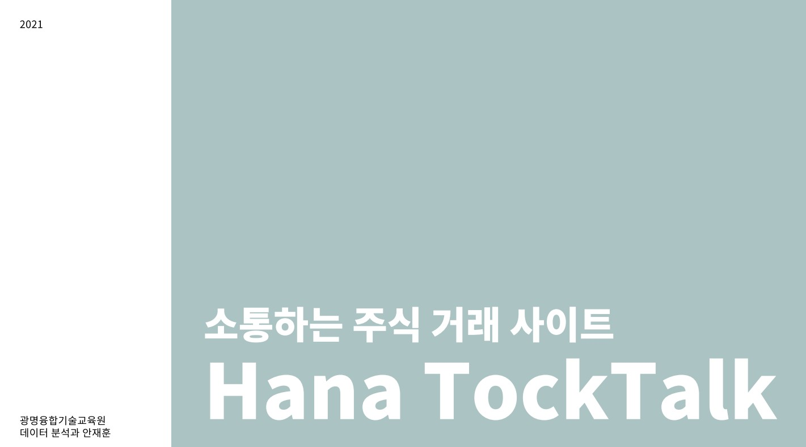

# TockTalk

[프로젝트 홈페이지 - https://koposoftware.github.io/2021_9_jhan/]

git page - https://github.com/koposoftware/2021_9_jhan

# 1. 프로젝트 개요

## 프로젝트 개요
 많은 신규 가입자가 주식에 관심을 가지고 증권계좌를 개설하고 있습니다.
 그중에서 대외금융자산 투자를 시작하는 초보 투자자들을 위한 투자 및 소통 서비스를 제공하려 합니다.

## 프로젝트 개발 환경
- OS : Windows10 64bit 
- Framework : Spring Framework 4,
- WAS : Tomcat9, Apache-2.4

## 프로젝트 Language/Tool/DB
- Language : Java 1.8, JavaScript ES5  
- Tools : Eclipse 
- DataBase: Oracle 19c 
- Library : Bootstrap 4.5, Jquery 3.6, Chartjs 2.4 & 3.4.1, 
          Junit 4.13, Logback 1.2.3, Mybatis 3.5.3
- API : Alpha Vintage, TradingView

# 2. 프로젝트 제안서

   [발표자료](/ppt1.pdf) 

# 3. 프로젝트 결과

## 발표 ppt 
   [발표자료](/project.pptx) 

## 시연 동영상 

  <iframe width="1180" height="664" src="https://www.youtube.com/embed/CD0yBfelqKM" title="YouTube video player" frameborder="0" allow="accelerometer; autoplay; clipboard-write; encrypted-media; gyroscope; picture-in-picture" allowfullscreen></iframe>
  
  
# 4. 본인 소개

| 이름 |안재훈| 

|연락처 | dybe15(@)naver.com|

|skill set| Frontend - HTML, CSS, Javascript|

| Backend - Java, Spring, Oracle|

|자격증|  정보처리기사|

# 5. 프로젝트 사용기술 

## 사용기술
-Spring MVC 
- Websocket
- Chart Js를 이용한 데이터 시각화
- Java Scheduler를 활용한 주식 데이터 자동 수집
- SHA-512 단방향 암호화 처리
- PL/SQL
   
  
# 6. 기대효과 및 보완점
- 많은 신규 가입자가 주식에 관심을 가지고 증권계좌를 개설하고 있습니다. 그 중에서 대외금융자산 투자를 시작하는 초보 투자자들을 위한 투자 및 소통의 공간을 제공합니다. 
- 그로 인해 두 분야의 이용고객에 대한 점유율을 증가시키는 기대효과를 볼 수 있습니다.

- 보완사항으로는 종목 추가와 메신저 기능의 고도화, Paas 컴퓨팅 클라우드 방식으로 배포 등이 있습니다.
