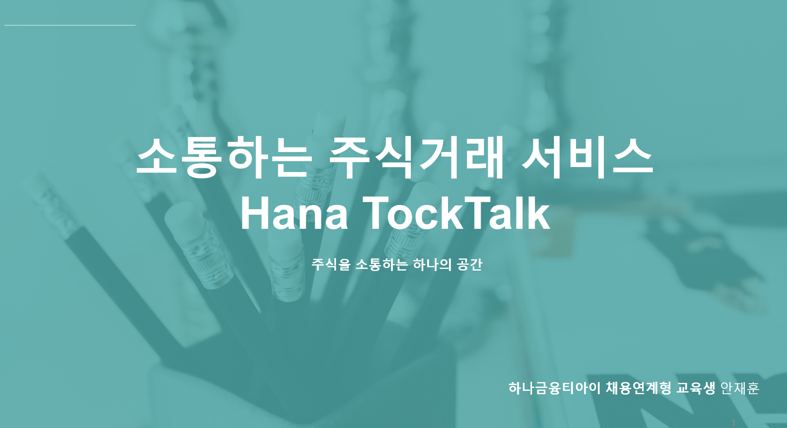
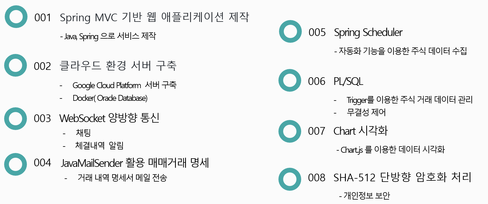

# 하나 TockTalk

[프로젝트 홈페이지 - https://koposoftware.github.io/2021_9_jhan/]

# 1. 프로젝트 개요

 많은 신규 가입자가 주식에 관심을 가지고 증권계좌를 개설하고 있습니다.
 그중에서 대외금융자산 투자를 시작하는 초보 투자자들을 위한 투자 및 소통 서비스를 제공하려 합니다.

# 2. 프로젝트 제안서

   [발표자료](/ppt1.pdf) 

# 3. 프로젝트 결과

## 발표 ppt 
   [발표자료](/project.pptx) 

## 시연 동영상 

   <iframe id="ytplayer" type="text/html" width="640" height="360" src="https://www.youtube.com/embed/6LxbdIjWP04" frameborder="0"></iframe>

# 4. 본인 소개

본인 소개를 추가하세요

|이름 |안재훈|!  (/ANJAEHUN.jpg)|

|연락처 | dybe15(@)naver.com|

|skill set| Frontend - HTML, CSS, Javascript|

| | Backend - Java, Spring, Oracle|

|자격증|  정보처리기사|

# 5. 프로젝트 사용기술 

  (/skill.png)
